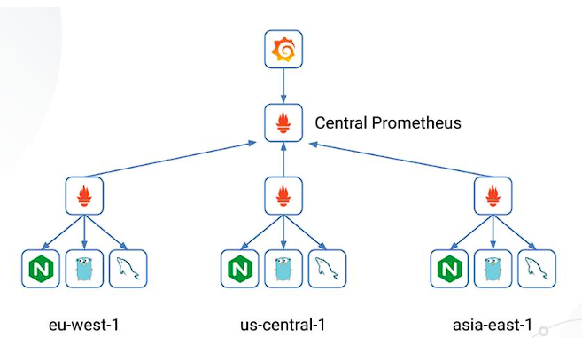
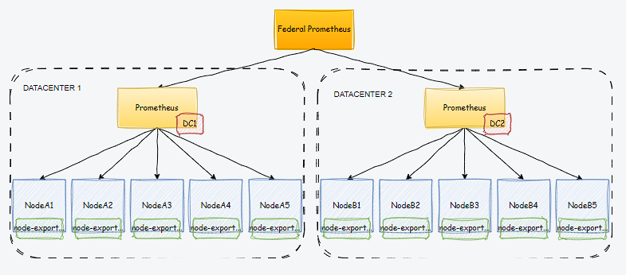
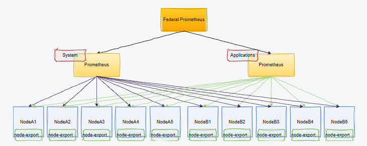
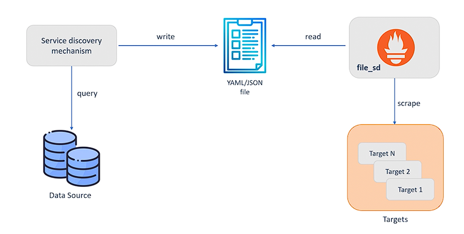

<!-- Improved compatibility of back to top link: See: https://github.com/othneildrew/Best-README-Template/pull/73 -->

<a name="readme-top"></a>

<!--
*** Thanks for checking out the Best-README-Template. If you have a suggestion
*** that would make this better, please fork the repo and create a pull request
*** or simply open an issue with the tag "enhancement".
*** Don't forget to give the project a star!
*** Thanks again! Now go create something AMAZING! :D
-->

<!-- PROJECT SHIELDS -->

<!--
*** I'm using markdown "reference style" links for readability.
*** Reference links are enclosed in brackets [ ] instead of parentheses ( ).
*** See the bottom of this document for the declaration of the reference variables
*** for contributors-url, forks-url, etc. This is an optional, concise syntax you may use.
*** https://www.markdownguide.org/basic-syntax/#reference-style-links
-->

[](https://github.com/marcossilvestrini/kubernetes-observability/actions/workflows/release.yml)[](https://github.com/marcossilvestrini/kubernetes-observability/actions/workflows/generate-html.yml)[](https://github.com/marcossilvestrini/kubernetes-observability/actions/workflows/slack.yml)

[![Contributors][contributors-shield]][contributors-url][![Forks][forks-shield]][forks-url][![Stargazers][stars-shield]][stars-url][![Issues][issues-shield]][issues-url][![MIT License][license-shield]][license-url][![LinkedIn][linkedin-shield]][linkedin-url]

<!-- PROJECT LOGO -->

<br />
<div align="center">
  <a href="https://github.com/marcossilvestrini/kubernetes-observability">
    
  </a>

<h3 align="center">Kubernetes Observability</h3>

  <p align="center">
    Project for learning about Kubernetes observability.
    <br />
    <a href="https://github.com/marcossilvestrini/kubernetes-observability"><strong>Explore the docs »</strong></a>
    <br />
    <br />
    <a href="https://marcossilvestrini.github.io/kubernetes-observability">Project Page</a>
    -
    <a href="https://github.com/marcossilvestrini/kubernetes-observability/issues">Report Bug</a>
    -
    <a href="https://github.com/marcossilvestrini/kubernetes-observability/issues">Request Feature</a>
  </p>
</div>

* * *

<!-- TABLE OF CONTENTS -->

<details>
  <summary>Table of Contents</summary>
  <ol>
    <li>
      <a href="#about-the-project">About The Project</a>
      <ul>
        <li><a href="#built-with">Built With</a></li>
      </ul>
    </li>
    <li>
      <a href="#getting-started">Getting Started</a>
      <ul>
        <li><a href="#prerequisites">Prerequisites</a></li>
        <li><a href="#installation">Installation</a></li>
      </ul>
    </li>
    <li><a href="#usage">Usage</a></li>
    <li><a href="#roadmap">Roadmap</a></li>
    <li><a href="#contributing">Contributing</a></li>
    <li><a href="#license">License</a></li>
    <li><a href="#contact">Contact</a></li>
    <li><a href="#acknowledgments">Acknowledgments</a></li>
  </ol>
</details>

* * *

<!-- ABOUT THE PROJECT -->

## حول المشروع

هذا المشروع مخصص للتعرف على إمكانية ملاحظة kubernetes.

<p align="right">(<a href="#readme-top">back to top</a>)</p>

* * *

### بنيت مع

-   [![Github][Github-badge]][Github-url]
-   [![GNULinux][GNULinux-badge]][GNULinux-url]
-   [![Windows][Windows-badge]][Windows-url]
-   [![Bash][Bash-badge]][Bash-url]
-   [![Powershell][Powershell-badge]][Powershell-url]
-   [![Kubernetes][Kubernetes-badge]][Kubernetes-url]

<p align="right">(<a href="#readme-top">back to top</a>)</p>

* * *

<!-- GETTING STARTED -->

## ابدء

يهدف هذا المشروع إلى البدء باستخدام أدوات مراقبة kubernetes وأفضل الممارسات.

بعض أدوات التعلم:

-   بروميثيوس
-   مدير التنبيه
-   جرافانا
-   جرافانا لوكي
-   توقيت غرافانا

* * *

### المتطلبات الأساسية

-   رفع نظام لينكس
-   مجموعة Kubernetes لأعلى
-   شخص سخيف

* * *

### تثبيت

استنساخ الريبو

```sh
git clone https://github.com/marcossilvestrini/kubernetes-observability.git
cd kubernetes-observability || exit
```

<p align="right">(<a href="#readme-top">back to top</a>)</p>

* * *

<!-- USAGE EXAMPLES -->

## الاستخدام

أنشر بعض الأمثلة لاستخدامها في هذا المستودع.

<p align="right">(<a href="#readme-top">back to top</a>)</p>

* * *

<!-- ROADMAP -->

## خريطة الطريق

-   [x] إنشاء مستودع
-   [ ] بروميثيوس
-   [ ] مدير التنبيه
-   [ ] جرافانا
-   [ ] جرافانا لوكي
-   [ ] توقيت جرافانا
-   [ ] سبائك جرافانا
-   [ ] أدوات أخرى

انظر[القضايا المفتوحة](https://github.com/marcossilvestrini/kubernetes-observability/issues)للحصول على قائمة كاملة بالميزات المقترحة (والمشكلات المعروفة).

<p align="right">(<a href="#readme-top">back to top</a>)</p>

* * *

## بروميثيوس


Prometheus عبارة عن مجموعة أدوات مراقبة وتنبيه للأنظمة مفتوحة المصدر تم إنشاؤها في الأصل على SoundCloud.

منذ إنشائه في عام 2012، اعتمدت العديد من الشركات والمنظمات بروميثيوس، ويمتلك المشروع مجتمع مطورين ومستخدمين نشطين للغاية.

يتكون نظام بروميثيوس البيئي من مكونات متعددة، الكثير منها اختياري:

-   خادم بروميثيوس الرئيسي الذي يقوم بجمع وتخزين بيانات السلاسل الزمنية
-   مكتبات العملاء لأدوات رمز التطبيق
-   بوابة دفع لدعم الوظائف قصيرة الأجل
-   المصدرون لأغراض خاصة لخدمات مثل HAProxy وStatsD وGraphite وما إلى ذلك.
-   مدير التنبيهات للتعامل مع التنبيهات
-   أدوات الدعم المختلفة

لمزيد من المعلومات حول الوصول إلى الوثائق الرسمية لبروميثيوس:  
[هتبص://بروميثيوس.إيه/دكس/انطردكت/فرفو/](https://prometheus.io/docs/introduction/overview/)

### أسماء المقاييس والتسميات

**مثال لاسم المقياس:**

```yaml
<metric name>{<label name>=<label value>, ...}
```

**مثال لاسم المقياس مع التصنيفات:**

```yaml
api_http_requests_total{method="POST", handler="/messages"}
```

### أنواع المقاييس


**[عداد](https://prometheus.io/docs/concepts/metric_types/#counter)**- يقبل ويخزن فقط تلك القيم التي ستزداد مع مرور الوقت.  
**[كَيّل](https://prometheus.io/docs/concepts/metric_types/#gauge)**- يخزن القيم التي يمكن أن تأخذ قيمًا مختلفة، والتي يمكن أن تزيد أو تنقص.  
**[الرسم البياني](https://prometheus.io/docs/concepts/metric_types/#histogram)**- عينات من الملاحظات (عادةً أشياء مثل فترات الطلب أو أحجام الاستجابة) واحتسابها في مجموعات قابلة للتكوين. كما يوفر أيضًا مجموعًا لكل القيم التي تمت ملاحظتها، مما يسمح لك بحساب المتوسطات.  
**[ملخص](https://prometheus.io/docs/concepts/metric_types/#histogram)**– رسم بياني مع تمثيل بيانات أكثر تفصيلاً باستخدام إحصائيات إضافية (كميات).

### الوظائف والمثيلات


في مصطلحات بروميثيوس، تسمى نقطة النهاية التي يمكنك استخلاصها بمثيل، وعادةً ما تتوافق مع عملية واحدة.  
مجموعة من الحالات التي لها نفس الغرض، وهي عملية يتم تكرارها من أجل قابلية التوسع أو الموثوقية على سبيل المثال، تسمى وظيفة.

### مواصفات بروميثيوس للكتابة عن بعد

تم تصميم بروتوكول الكتابة عن بعد لتمكين نشر العينات بشكل موثوق في الوقت الفعلي من المرسل إلى المتلقي، دون خسارة.

-   "المرسل" هو الشيء الذي يرسل بيانات Prometheus Remote Write.
-   "المستقبل" هو شيء يستقبل بيانات الكتابة عن بعد من Prometheus.
-   "العينة" هي زوج من (الطابع الزمني، القيمة).
-   "التسمية" هي زوج من (المفتاح، القيمة).
-   "السلسلة" هي قائمة بالعينات، يتم تحديدها بواسطة مجموعة فريدة من التصنيفات.

#### المرسلون والمستقبلون المتوافقون

تهدف المواصفات إلى وصف كيفية تفاعل المكونات التالية:

-   بروميثيوس (كالمرسل والمستقبل)
-   الانهيار الجليدي (بصفته "المرسل") - أداة اختبار الحمل بمقاييس بروميثيوس.
-   القشرة (بوصفها "المتلقي")
-   العامل المرن (بوصفه "المستقبل")
-   وكيل Grafana (بوصفه "مرسلًا" و"مستقبلًا")
-   GreptimeDB (بوصفه "المتلقي")
-   وكيل Telegraf الخاص بـ InfluxData. (كمرسل وكمستقبل)
-   M3 (بوصفه "المتلقي")
-   ميمير (بصفته "المتلقي")
-   OpenTelemetry Collector (بصفته "مرسلًا" وفي النهاية "مستقبلًا")
-   ثانوس (بوصفه "المتلقي")
-   المتجه (بوصفه "المرسل" و"المتلقي")
-   VictoriaMetrics (بوصفها "المتلقي")

### [مغسولة](https://prometheus.io/docs/prometheus/latest/querying/basics/)


توفر Prometheus لغة استعلام وظيفية تسمى PromQL (لغة استعلام Prometheus) التي تتيح للمستخدم تحديد وتجميع بيانات السلاسل الزمنية في الوقت الفعلي.  
يمكن عرض نتيجة التعبير إما على شكل رسم بياني، أو عرضها كبيانات جدولية في متصفح تعبيرات Prometheus، أو استهلاكها بواسطة أنظمة خارجية عبر HTTP API.

[أمثلة الاستعلام](https://prometheus.io/docs/prometheus/latest/querying/examples/)

### [الاتحاد](https://prometheus.io/docs/prometheus/latest/federation/#federation)



يسمح الاتحاد لخادم Prometheus باستخلاص السلاسل الزمنية المحددة من خادم Prometheus آخر.

#### الاتحاد الهرمي

يسمح الاتحاد الهرمي لشركة Prometheus بالتوسع في البيئات التي تحتوي على عشرات مراكز البيانات وملايين العقد.

في حالة الاستخدام هذه، تشبه طوبولوجيا الاتحاد شجرة، حيث تقوم خوادم Prometheus ذات المستوى الأعلى بجمع بيانات السلاسل الزمنية المجمعة من عدد أكبر من الخوادم الثانوية.

وهذا يعني أن لدينا خوادم Prometheus أكبر حجمًا تقوم بجمع بيانات السلاسل الزمنية من الخوادم الأصغر حجمًا. لدينا نهج من أعلى إلى أسفل حيث يتم جمع البيانات من مستويات مختلفة.



#### الاتحاد عبر الخدمات

تتضمن هذه الطريقة خادم Prometheus الذي يراقب خدمة معينة أو مجموعة من الخدمات، ويجمع بيانات سلاسل زمنية محددة من خادم آخر يراقب مجموعة مختلفة من الخدمات.

على سبيل المثال، قد يعرض برنامج جدولة نظام المجموعة الذي يقوم بتشغيل خدمات متعددة معلومات استخدام الموارد (مثل الذاكرة واستخدام وحدة المعالجة المركزية) حول مثيلات الخدمة التي تعمل على نظام المجموعة.

ومن ناحية أخرى، فإن الخدمة التي يتم تشغيلها على تلك المجموعة ستكشف فقط عن مقاييس الخدمة الخاصة بالتطبيق.

في كثير من الأحيان، يتم جمع هاتين المجموعتين من المقاييس بواسطة خوادم Prometheus منفصلة. باستخدام الاتحاد، قد يقوم خادم Prometheus الذي يحتوي على مقاييس مستوى الخدمة بسحب مقاييس استخدام موارد المجموعة حول خدمته المحددة من مجموعة Prometheus، بحيث يمكن استخدام مجموعتي المقاييس داخل ذلك الخادم.

ومن خلال القيام بذلك، يمكننا تشغيل الاستعلامات والتنبيهات على البيانات المدمجة من كلا الخادمين.



### اكتشاف خدمة HTTP



يوفر Prometheus اكتشافًا عامًا لخدمة HTTP، والذي يمكّنه من اكتشاف الأهداف عبر نقطة نهاية HTTP.

يعد اكتشاف خدمة HTTP مكملاً لآليات اكتشاف الخدمة المدعومة، وهو بديل لاكتشاف الخدمة المستند إلى الملف.

-   لا يتم توسيع نطاق static_configs إلى بيئات أكثر ديناميكية حيث تتم إضافة/إزالة المثيلات بشكل متكرر
-   يمكن أن يتكامل Prometheus مع آليات اكتشاف الخدمة لتحديث عرضه للمثيلات قيد التشغيل تلقائيًا
    -   عند إضافة مثيلات جديدة، سيبدأ Prometheus في الحذف، وعند فقده من الاكتشاف، ستتم أيضًا إزالة السلسلة الزمنية
    -   عمليات التكامل المضمنة مع Consul أو Azure أو AWS أو الملف بناءً على الحاجة إلى آلية مخصصة
-   يمكن نشر ملف JSON/YAML بواسطة النظام الأساسي مع تحديد جميع الأهداف التي سيتم التخلص منها. يستخدمه بروميثيوس لتحديث الأهداف تلقائيًا

### تثبيت بروميثيوس

```sh
# Download files - https://prometheus.io/download/
wget https://github.com/prometheus/prometheus/releases/download/v2.51.2/prometheus-2.51.2.linux-amd64.tar.gz

# Extract files
tar xvfz prometheus-*.tar.gz
rm  prometheus-*.tar.gz
cd prometheus-*

# Check version
./prometheus --version
```

### تكوين بروميثيوس

انظر ملف التكوين الخاص بي[prometheus.yaml](./prometheus/configs/prometheus_1.yml)

```sh
vim prometheus.yaml
```

```yaml
# my global config
global:
  scrape_interval: 15s # Set the scrape interval to every 15 seconds. Default is every 1 minute.
  evaluation_interval: 15s # Evaluate rules every 15 seconds. The default is every 1 minute.
  # scrape_timeout is set to the global default (10s).

# Alertmanager configuration
alerting:
  alertmanagers:
    - static_configs:
        - targets:
          # - alertmanager:9093

# Load rules once and periodically evaluate them according to the global 'evaluation_interval'.
rule_files:
  # - "first_rules.yml"
  # - "second_rules.yml"

# A scrape configuration containing exactly one endpoint to scrape:
# Here it's Prometheus itself.
scrape_configs:
  # The job name is added as a label `job=<job_name>` to any timeseries scraped from this config.
  - job_name: "prometheus"

    # metrics_path defaults to '/metrics'
    # scheme defaults to 'http'.

    static_configs:
      - targets: ["localhost:9090"]
```

### ابدأ بروميثيوس

```sh
# Start
./prometheus --config.file=prometheus.yml

# Start with PM2 - npm install pm2@latest -g
pm2 start prometheus --name prometheus-server -- --config.file=prometheus.yml
```

### نقاط النهاية الهامة

```sh
http://localhost:9090 # all endpoints
http://localhost:9090/graph # PromQL expressions
http://localhost:9090/metrics # metrics
http://localhost:9090/targets # scrape_configs jobs
```

### باستخدام متصفح التعبير

يمكنك استخدام التعبير في وضع الجدول أو الرسم البياني.

افتح الصفحة http&#x3A;//localhost:9090

```sh
# Check all http metrics
promhttp_metric_handler_requests_total

# Check http metrics with http status code 200
promhttp_metric_handler_requests_total{code="200"}

# Count http metrics
count(promhttp_metric_handler_requests_total)

# Rate function
rate(promhttp_metric_handler_requests_total{code="200"}[1m])
```

### المصدرين بروميثيوس

المُصدِّر هو برنامج ثنائي يعمل جنبًا إلى جنب مع التطبيق الذي تريد الحصول على المقاييس منه.  
يعرض المصدر مقاييس Prometheus، عادةً عن طريق تحويل المقاييس التي يتم عرضها بتنسيق غير Prometheus إلى تنسيق يدعمه Prometheus.

#### مصدر العقدة

يعرض Prometheus Node Exporter مجموعة واسعة من المقاييس المتعلقة بالأجهزة والنواة.

##### تثبيت مصدر العقدة

```sh
# Download - https://prometheus.io/download#node_exporter
wget https://github.com/prometheus/node_exporter/releases/download/v1.7.0/node_exporter-1.7.0.linux-amd64.tar.gz

# Extract
tar xvfz node_exporter-*.*-amd64.tar.gz
cd node_exporter-*.*-amd64
```

##### بدء تشغيل مُصدِّر العقدة

```sh
# Start
./node_exporter

# Start with PM2 - npm install pm2@latest -g
pm2 start node_exporter --name node_exporter
```

##### مصدر عقدة نقاط النهاية

```sh
# Access metrics
http://localhost:9100/metrics
```

##### تكوين مصدر العقدة

لتمكين الخردة لمصدر العقدة، يمكنك تكوين بروميثيوس.

```sh
# Edit prometheus file and add job node
vim prometheus.yaml
```

```yaml
...
scrape_configs:
- job_name: node
  static_configs:
  - targets: ['localhost:9100']
...
```

أعد تشغيل خدمة بروميثيوس لتطبيق وظيفة جديدة.

* * *

### بوابة الدفع

Prometheus Pushgateway هي خدمة وسيطة تسمح للمهام المؤقتة والدفعية بعرض مقاييسها إلى Prometheus.  
نظرًا لأن هذه الأنواع من الوظائف قد لا تكون موجودة لفترة كافية ليتم التخلص منها، فيمكنها بدلاً من ذلك دفع مقاييسها إلى Pushgateway.  
يعمل Pushgateway بعد ذلك كمخزن مؤقت للقياسات يقوم بروميثيوس بمسحه.

يعد هذا الإعداد مفيدًا بشكل خاص لالتقاط نتائج المهمة التي لا يتم تشغيلها بشكل مستمر، مثل مهمة مجمعة في نظام CI، أو برنامج نصي احتياطي يعمل في وقت محدد.  
إنه يبسط مراقبة هذه الأنواع من الوظائف دون الحاجة إلى تشغيل مثيل Prometheus طويل الأمد والذي قد يستمر لفترة أطول من الوظائف نفسها.

#### تثبيت PushGateway

```sh
# Download 
wget -q https://github.com/prometheus/pushgateway/releases/download/v1.8.0/pushgateway-1.8.0.linux-amd64.tar.gz

# Extract
tar xvfz pushgateway-*.*-amd64.tar.gz
cd pushgateway-*.*-amd64

# Start 
# Start with PM2 - npm install pm2@latest -g
pm2 start pushgateway --name pushgateway -- --web.listen-address "192.168.0.130:9091"
```

#### تكوين PushGateway

```sh
# Edit prometheus file and add job pushgateway
vim prometheus.yaml
```

```yaml
scrape_configs:
  - job_name: 'pushgateway'
    honor_labels: true
    static_configs:
      - targets: ['192.168.0.130:9091'] # prometheus server for scraping
```

```sh
# Restart prometheus

# restart with pm2
pm2 restart prometheus-server
```

#### إنشاء مقاييس لبوابة الدفع للاختبار

```sh
echo 'training_completion{course="CKA", status="complete"} 1' > metrics.txt
echo 'training_completion{course="CKS", status="in_progress"} 0.5' >> metrics.txt
echo 'training_completion{course="LPIC2", status="not_started"} 0' >> metrics.txt
curl --data-binary @metrics.txt http://192.168.0.130:9091/metrics/job/training_metrics
```

##### نقاط النهاية PushGateway

```sh
# Access metrics
http://localhost:9091
```

#### استخدم PromQL للعثور على هدف بوابة الدفع للمقاييس


### بروملينز

#### قم بتثبيت بروملينز

_العمل فقط دون المصادقة الأساسية_

```sh
echo "Downloading Promlens..."
wget -q https://github.com/prometheus/promlens/releases/download/v0.3.0/promlens-0.3.0.linux-amd64.tar.gz

echo "Extracting Promlens..."
tar xvfz promlens-*.*-amd64.tar.gz
rm promlens-*.*-amd64.tar.gz
cd promlens-*.*-amd64 || exit

echo "Starting Promlens..."
pm2 start promlens --name promlens -- --web.listen-address "192.168.0.130:8081"
cd || exit
```

#### نقاط النهاية بروملينس

```sh
# Access query builder
http://192.168.0.130:8081
```


* * *

### مدير التنبيه


لمزيد من المعلومات حول الوثائق الرسمية للوصول إلى Alertmanager:  
[هتبص://جذب.كوم/بروميثيوس/الارتمانجر](https://github.com/prometheus/alertmanager)

<p align="right">(<a href="#readme-top">back to top</a>)</p>

* * *

## جرافانا

* * *

### جرافانا لوكي

* * *

### توقيت غرافانا

* * *

### سبائك جرافانا

<p align="right">(<a href="#readme-top">back to top</a>)</p>

* * *

<!-- CONTRIBUTING -->

## المساهمة

المساهمات هي ما يجعل مجتمع المصادر المفتوحة مكانًا رائعًا للتعلم والإلهام والإبداع. أي مساهمات تقدمها هي**اقدر هذا جدا**.

إذا كان لديك اقتراح من شأنه أن يجعل هذا الأمر أفضل، فيرجى شوكة الريبو وإنشاء طلب سحب. يمكنك أيضًا ببساطة فتح مشكلة بالعلامة "التحسين".
لا تنس أن تعطي المشروع نجمة! شكرًا لك مرة أخرى!

1.  شوكة المشروع
2.  قم بإنشاء فرع الميزات الخاص بك (`git checkout -b feature/AmazingFeature`)
3.  تنفيذ التغييرات (`git commit -m 'Add some AmazingFeature'`)
4.  ادفع إلى الفرع (`git push origin feature/AmazingFeature`)
5.  افتح طلب السحب

<p align="right">(<a href="#readme-top">back to top</a>)</p>

* * *

<!-- LICENSE -->

## رخصة

وزعت بموجب ترخيص معهد ماساتشوستس للتكنولوجيا. يرى[`LICENSE`](LICENSE)للمزيد من المعلومات.

<p align="right">(<a href="#readme-top">back to top</a>)</p>

* * *

<!-- CONTACT -->

## اتصال

-   ماركوس سيلفستريني -[@mrsilvestrini](https://twitter.com/mrsilvestrini)
-   [ماركوس.سيلفسترن@جميل.كوم](mailto:marcos.silvestrini@gmail.com)

رابط المشروع:[هتبص://جذب.كوم/ماركسيلفصترن/كوبرنتصبصرفبلت](https://github.com/marcossilvestrini/kubernetes-observability)

<p align="right">(<a href="#readme-top">back to top</a>)</p>

* * *

<!-- ACKNOWLEDGMENTS -->

## شكر وتقدير

-   [بروميثيوس](https://prometheus.io/docs/introduction/overview/)
-   [تكوينات بروميثيوس](https://github.com/alerta/prometheus-config/tree/master/config)
-   [بروميثيوس تخصيصات المنفذ الافتراضي](https://github.com/prometheus/prometheus/wiki/Default-port-allocations)
-   [بوابة الدفع](https://github.com/prometheus/pushgateway/blob/master/README.md)
-   [المصدرين](https://prometheus.io/docs/instrumenting/exporters/)
-   [مصدر العقدة](https://github.com/prometheus/node_exporter)
-   [مقالة PromQL](https://www.metricfire.com/blog/getting-started-with-promql/)
-   [مقالات بروميثيوس](./README.md)
    -   [اتحاد بروميثيوس](https://www.dbi-services.com/blog/high-availability-and-hierarchical-federation-with-prometheus/)
    -   [مراقبة بروميثيوس: الدليل النهائي في عام 2019](https://devconnected.com/the-definitive-guide-to-prometheus-in-2019/)
    -   [اكتشاف خدمة بروميثيوس](https://ryanharrison.co.uk/2021/04/05/prometheus-monitoring-guide-part-1-install-instrumentation.html)
    -   [مقالة كوب بروميثيوس ستاك](https://www.kubecost.com/kubernetes-devops-tools/kube-prometheus/)

<p align="right">(<a href="#readme-top">back to top</a>)</p>

<!-- MARKDOWN LINKS & IMAGES -->

<!-- https://www.markdownguide.org/basic-syntax/#reference-style-links -->

[contributors-shield]: https://img.shields.io/github/contributors/marcossilvestrini/kubernetes-observability.svg?style=for-the-badge

[contributors-url]: https://github.com/marcossilvestrini/kubernetes-observability/graphs/contributors

[forks-shield]: https://img.shields.io/github/forks/marcossilvestrini/kubernetes-observability.svg?style=for-the-badge

[forks-url]: https://github.com/marcossilvestrini/kubernetes-observability/network/members

[stars-shield]: https://img.shields.io/github/stars/marcossilvestrini/kubernetes-observability.svg?style=for-the-badge

[stars-url]: https://github.com/marcossilvestrini/kubernetes-observability/stargazers

[issues-shield]: https://img.shields.io/github/issues/marcossilvestrini/kubernetes-observability.svg?style=for-the-badge

[issues-url]: https://github.com/marcossilvestrini/kubernetes-observability/issues

[license-shield]: https://img.shields.io/github/license/marcossilvestrini/kubernetes-observability.svg?style=for-the-badge

[license-url]: https://github.com/marcossilvestrini/kubernetes-observability/blob/master/LICENSE

[linkedin-shield]: https://img.shields.io/badge/-LinkedIn-black.svg?style=for-the-badge&logo=linkedin&colorB=555

[linkedin-url]: https://linkedin.com/in/marcossilvestrini

[Github-badge]: https://img.shields.io/badge/github-%23121011.svg?style=for-the-badge&logo=github&logoColor=white

[Github-url]: https://github.com/

[GNULinux-badge]: https://img.shields.io/badge/Linux-FCC624?style=for-the-badge&logo=linux&logoColor=black

[GNULinux-url]: https://www.gnu.org/gnu/linux-and-gnu.en.html

[Windows-badge]: https://img.shields.io/badge/Windows-0078D6?style=for-the-badge&logo=windows&logoColor=white

[Windows-url]: https://www.microsoft.com/

[Powershell-badge]: https://img.shields.io/badge/PowerShell-%235391FE.svg?style=for-the-badge&logo=powershell&logoColor=white

[Powershell-url]: https://learn.microsoft.com/en-us/powershell/

[Bash-badge]: https://img.shields.io/badge/shell_script-%23121011.svg?style=for-the-badge&logo=gnu-bash&logoColor=white

[Bash-url]: https://www.gnu.org/software/bash/

[Kubernetes-badge]: https://img.shields.io/badge/kubernetes-%23326ce5.svg?style=for-the-badge&logo=kubernetes&logoColor=white

[Kubernetes-url]: https://kubernetes.io/docs/home/
