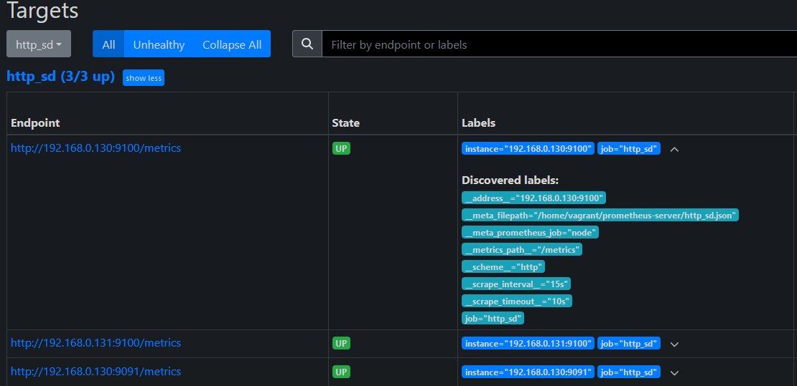

<!-- Improved compatibility of back to top link: See: https://github.com/othneildrew/Best-README-Template/pull/73 -->

<a name="readme-top"></a>

<!--
*** Thanks for checking out the Best-README-Template. If you have a suggestion
*** that would make this better, please fork the repo and create a pull request
*** or simply open an issue with the tag "enhancement".
*** Don't forget to give the project a star!
*** Thanks again! Now go create something AMAZING! :D
-->

<!-- PROJECT SHIELDS -->

<!--
*** I'm using markdown "reference style" links for readability.
*** Reference links are enclosed in brackets [ ] instead of parentheses ( ).
*** See the bottom of this document for the declaration of the reference variables
*** for contributors-url, forks-url, etc. This is an optional, concise syntax you may use.
*** https://www.markdownguide.org/basic-syntax/#reference-style-links
-->

[](https://github.com/marcossilvestrini/learning-observability/actions/workflows/release.yml)[](https://github.com/marcossilvestrini/learning-observability/actions/workflows/generate-html.yml)[](https://github.com/marcossilvestrini/learning-observability/actions/workflows/slack.yml)

[![Contributors][contributors-shield]][contributors-url][![Forks][forks-shield]][forks-url][![Stargazers][stars-shield]][stars-url][![Issues][issues-shield]][issues-url][![MIT License][license-shield]][license-url][![LinkedIn][linkedin-shield]][linkedin-url]

<!-- PROJECT LOGO -->

<br />
<div align="center">
  <a href="https://github.com/marcossilvestrini/learning-observability">
    
  </a>

<h3 align="center">Learning Obserbability</h3>

  <p align="center">
    Project for learning about Learning Obserbability.
    <br />
    <a href="https://github.com/marcossilvestrini/learning-observability"><strong>Explore the docs »</strong></a>
    <br />
    <br />
    <a href="https://marcossilvestrini.github.io/learning-observability">Project Page</a>
    -
    <a href="https://github.com/marcossilvestrini/learning-observability/issues">Report Bug</a>
    -
    <a href="https://github.com/marcossilvestrini/learning-observability/issues">Request Feature</a>
  </p>
</div>

* * *

<!-- TABLE OF CONTENTS -->

<details>
  <summary>Table of Contents</summary>
  <ol>
    <li>
      <a href="#about-the-project">About The Project</a>
      <ul>
        <li><a href="#built-with">Built With</a></li>
      </ul>
    </li>
    <li>
      <a href="#getting-started">Getting Started</a>
      <ul>
        <li><a href="#prerequisites">Prerequisites</a></li>
        <li><a href="#installation">Installation</a></li>
      </ul>
    </li>
    <li><a href="#usage">Usage</a></li>
    <li><a href="#roadmap">Roadmap</a></li>
    <li><a href="#contributing">Contributing</a></li>
    <li><a href="#license">License</a></li>
    <li><a href="#contact">Contact</a></li>
    <li><a href="#acknowledgments">Acknowledgments</a></li>
  </ol>
</details>

* * *

<!-- ABOUT THE PROJECT -->

## 關於該項目

這個專案是為了學習 kubernetes 可觀察性。

<p align="right">(<a href="#readme-top">back to top</a>)</p>

* * *

### 內建

-   [![Github][Github-badge]][Github-url]
-   [![GNULinux][GNULinux-badge]][GNULinux-url]
-   [![Windows][Windows-badge]][Windows-url]
-   [![Bash][Bash-badge]][Bash-url]
-   [![Powershell][Powershell-badge]][Powershell-url]
-   [![Kubernetes][Kubernetes-badge]][Kubernetes-url]

<p align="right">(<a href="#readme-top">back to top</a>)</p>

* * *

<!-- GETTING STARTED -->

## 入門

該計畫旨在開始使用 kubernetes 可觀察性工具和最佳實踐。

一些學習工具：

-   普羅米修斯
-   警報管理器
-   格拉法納
-   格拉法娜·洛基
-   格拉法納時間

* * *

### 先決條件

-   Linux系統啟動
-   叢集 Kubernetes 啟動
-   git

* * *

### 安裝

克隆儲存庫

```sh
git clone https://github.com/marcossilvestrini/learning-observability.git
cd learning-observability || exit
```

<p align="right">(<a href="#readme-top">back to top</a>)</p>

* * *

<!-- USAGE EXAMPLES -->

## 用法

我發布了一些在此存儲庫中使用的範例。

<p align="right">(<a href="#readme-top">back to top</a>)</p>

* * *

<!-- ROADMAP -->

## 路線圖

-   [x] 建立儲存庫
-   [ ] 普羅米修斯
-   [ ] 警報管理器
-   [ ] 格拉法納
-   [ ] 格拉法娜·洛基
-   [ ] 格拉法納時間
-   [ ] 格拉法納合金
-   [ ] 其他工具

請參閱[開放式問題](https://github.com/marcossilvestrini/learning-observability/issues)取得建議功能（和已知問題）的完整清單。

<p align="right">(<a href="#readme-top">back to top</a>)</p>

* * *

## 普羅米修斯


Prometheus 是一個開源系統監控和警報工具包，最初是在 SoundCloud 建置的。

自2012年推出以來，許多公司和組織都採用了Prometheus，該專案擁有非常活躍的開發者和用戶社群。

Prometheus 生態系統由多個組件組成，其中許多組件是可選的：

-   主要的 Prometheus 伺服器，用於抓取和儲存時間序列數據
-   用於檢測應用程式程式碼的客戶端庫
-   支援短期工作的推送網關
-   HAProxy、StatsD、Graphite 等服務的特殊用途導出器。
-   處理警報的警報管理器
-   各種支援工具

有關 Prometheus 的更多資訊請訪問官方文件：  
<https://prometheus.io/docs/introduction/overview/>

### 指標名稱和標籤

**指標名稱範例：**

```yaml
<metric name>{<label name>=<label value>, ...}
```

**帶標籤的指標名稱範例：**

```yaml
api_http_requests_total{method="POST", handler="/messages"}
```

### 指標類型


**[櫃檯](https://prometheus.io/docs/concepts/metric_types/#counter)**– 僅接受並儲存那些隨時間增加的值。  
**[測量](https://prometheus.io/docs/concepts/metric_types/#gauge)**– 儲存可以取不同值的值，這些值既可以增加也可以減少。  
**[直方圖](https://prometheus.io/docs/concepts/metric_types/#histogram)**– 對觀察結果（通常是請求持續時間或回應大小）進行取樣，並將其計數到可設定的儲存桶中。它還提供所有觀察值的總和，使您可以計算平均值。  
**[概括](https://prometheus.io/docs/concepts/metric_types/#histogram)**– 使用附加統計資料（分位數）提供更詳細資料表示的直方圖。

### 作業和實例


在 Prometheus 術語中，您可以抓取的端點稱為實例，通常對應於單一進程。  
具有相同目的的實例的集合，例如為了可擴展性或可靠性而複製的進程，稱為作業。

### Prometheus 遠端寫入規範

遠端寫入協定旨在能夠將樣本從發送方即時可靠地傳播到接收方，而不會遺失。

-   「發送者」是發送 Prometheus 遠端寫入資料的東西。
-   「接收器」是接收 Prometheus 遠端寫入資料的東西。
-   「樣本」是一對（時間戳，值）。
-   「標籤」是一對（鍵，值）。
-   「系列」是樣本列表，由一組唯一的標籤標識。

#### 相容的發送器和接收器

該規範旨在描述以下元件如何交互作用：

-   普羅米修斯（作為“發送者”和“接收者”）
-   Avalanche（作為“發送者”）- 負載測試工具 Prometheus Metrics。
-   皮質（作為“接收器”）
-   彈性代理（作為「接收者」）
-   Grafana Agent（既作為「發送者」又作為「接收者」）
-   GreptimeDB（作為「接收者」）
-   InfluxData 的 Telegraf 代理程式。 （作為發送者和接收者）
-   M3（作為「接收器」）
-   密米爾（作為「接收者」）
-   OpenTelemetry Collector（作為「發送者」並最終作為「接收者」）
-   薩諾斯（作為「接收者」）
-   向量（作為“發送者”和“接收者”）
-   VictoriaMetrics（作為「接收者」）

### [洗掉了](https://prometheus.io/docs/prometheus/latest/querying/basics/)


Prometheus 提供了一種名為 PromQL（Prometheus Query Language）的功能查詢語言，可讓使用者即時選擇和聚合時間序列資料。  
表達式的結果可以顯示為圖表，在 Prometheus 表達式瀏覽器中以表格資料形式查看，或由外部系統透過 HTTP API 使用。

[查詢範例](https://prometheus.io/docs/prometheus/latest/querying/examples/)

### [聯邦](https://prometheus.io/docs/prometheus/latest/federation/#federation)


聯合允許 Prometheus 伺服器從另一個 Prometheus 伺服器抓取選定的時間序列。

#### 等級聯邦

分層聯合允許 Prometheus 擴展到具有數十個資料中心和數百萬個節點的環境。

在此用例中，聯合拓撲類似於樹，較高層級的 Prometheus 伺服器從大量從屬伺服器收集聚合時間序列資料。

這意味著我們擁有更大的 Prometheus 伺服器，可以從較小的伺服器收集時間序列資料。我們採用自上而下的方法，從不同層級收集資料。


#### 跨服務聯合

此方法涉及一個 Prometheus 伺服器監視特定服務或一組服務，從監視另一組不同服務的另一台伺服器收集特定的時間序列資料。

例如，執行多個服務的叢集調度程序可能會公開有關叢集上執行的服務執行個體的資源使用資訊（例如記憶體和 CPU 使用情況）。

另一方面，在該叢集上運行的服務將僅公開特定於應用程式的服務指標。

通常，這兩組指標是由單獨的 Prometheus 伺服器抓取的。使用聯合，包含服務等級指標的 Prometheus 伺服器可以從叢集 Prometheus 中提取有關其特定服務的叢集資源使用指標，以便兩組指標都可以在該伺服器內使用。

透過這樣做，我們可以對來自兩台伺服器的合併資料執行查詢和警報。


### HTTP 服務發現


Prometheus 提供了通用的 HTTP 服務發現，使其能夠透過 HTTP 端點發現目標。

HTTP 服務發現是支援的服務發現機制的補充，並且是基於檔案的服務發現的替代方案。

-   static_configs 無法擴展到頻繁新增/刪除實例的動態環境
-   Prometheus 可以與服務發現機制集成，以自動更新其正在運行的實例的視圖
    -   當新增實例時，Prometheus 將開始抓取，當發現遺失時，時間序列也將被刪除
    -   與 Consul、Azure、AWS 或基於文件的內建整合（如果需要自訂機制）
-   JSON/YAML 檔案可以由平台發布，指定要從中抓取的所有目標。 Prometheus 使用它來自動更新目標

#### 使用 http sd_file 的範例



prometheus.yaml 用於廢棄目標 http_sd.json 中的服務

```yaml
global:
  scrape_interval: 15s
  evaluation_interval: 15s
scrape_configs:  
  # Service Discovery with file_sd  
  - job_name: 'http_sd'
    basic_auth:
      username: "skynet"
      password: "prometheus"
    file_sd_configs:
      - files:
        - /home/vagrant/prometheus-server/http_sd.json
```

http_sd.json

```json
[
    {
        "targets": ["192.168.0.130:9100", "192.168.0.131:9100"],
        "labels": {            
            "__meta_prometheus_job": "node"
        }
    },
    {
        "targets": ["192.168.0.130:9091"],
        "labels": {            
            "__meta_prometheus_job": "pushgateway"
        }
    }    
]
```

### 安裝普羅米修斯

```sh
# Download files - https://prometheus.io/download/
wget https://github.com/prometheus/prometheus/releases/download/v2.51.2/prometheus-2.51.2.linux-amd64.tar.gz

# Extract files
tar xvfz prometheus-*.tar.gz
rm  prometheus-*.tar.gz
cd prometheus-*

# Check version
./prometheus --version
```

### 配置普羅米修斯

看我的設定檔[普羅米修斯.yaml](./prometheus/configs/prometheus_1.yml)

```sh
vim prometheus.yaml
```

```yaml
# my global config
global:
  scrape_interval: 15s # Set the scrape interval to every 15 seconds. Default is every 1 minute.
  evaluation_interval: 15s # Evaluate rules every 15 seconds. The default is every 1 minute.
  # scrape_timeout is set to the global default (10s).

# Alertmanager configuration
alerting:
  alertmanagers:
    - static_configs:
        - targets:
          # - alertmanager:9093

# Load rules once and periodically evaluate them according to the global 'evaluation_interval'.
rule_files:
  # - "first_rules.yml"
  # - "second_rules.yml"

# A scrape configuration containing exactly one endpoint to scrape:
# Here it's Prometheus itself.
scrape_configs:
  # The job name is added as a label `job=<job_name>` to any timeseries scraped from this config.
  - job_name: "prometheus"

    # metrics_path defaults to '/metrics'
    # scheme defaults to 'http'.

    static_configs:
      - targets: ["localhost:9090"]
```

### 啟動普羅米修斯

```sh
# Start
./prometheus --config.file=prometheus.yml

# Start with PM2 - npm install pm2@latest -g
pm2 start prometheus --name prometheus-server -- --config.file=prometheus.yml
```

### 重要端點

```sh
http://localhost:9090 # all endpoints
http://localhost:9090/graph # PromQL expressions
http://localhost:9090/metrics # metrics
http://localhost:9090/targets # scrape_configs jobs
```

### 使用表達式瀏覽器

您可以在表格或圖表模式下使用表達式。

開啟頁面http&#x3A;//localhost:9090

```sh
# Check all http metrics
promhttp_metric_handler_requests_total

# Check http metrics with http status code 200
promhttp_metric_handler_requests_total{code="200"}

# Count http metrics
count(promhttp_metric_handler_requests_total)

# Rate function
rate(promhttp_metric_handler_requests_total{code="200"}[1m])
```

### 普羅米修斯出口商

導出器是與您要從中獲取指標的應用程式一起運行的二進位檔案。  
導出器通常會透過將以非 Prometheus 格式公開的指標轉換為 Prometheus 支援的格式來公開 Prometheus 指標。

#### 節點導出器

Prometheus Node Exporter 公開了各種與硬體和核心相關的指標。

##### 安裝節點導出器

```sh
# Download - https://prometheus.io/download#node_exporter
wget https://github.com/prometheus/node_exporter/releases/download/v1.7.0/node_exporter-1.7.0.linux-amd64.tar.gz

# Extract
tar xvfz node_exporter-*.*-amd64.tar.gz
cd node_exporter-*.*-amd64
```

##### 啟動節點導出器

```sh
# Start
./node_exporter

# Start with PM2 - npm install pm2@latest -g
pm2 start node_exporter --name node_exporter
```

##### 端點節點導出器

```sh
# Access metrics
http://localhost:9100/metrics
```

##### 配置節點導出器

若要為節點匯出器啟用廢料，您可以設定 prometheus。

```sh
# Edit prometheus file and add job node
vim prometheus.yaml
```

```yaml
...
scrape_configs:
- job_name: node
  static_configs:
  - targets: ['localhost:9100']
...
```

重新啟動普羅米修斯服務以申請新工作。

* * *

### 推播網關

Prometheus Pushgateway 是一項中間服務，可讓臨時作業和批次作業將其指標公開給 Prometheus。  
由於此類工作可能存在的時間不夠長而無法刪除，因此他們可以將其指標推送到 Pushgateway。  
然後，Pushgateway 充當 Prometheus 抓取的臨時指標儲存。

此設定對於擷取不連續執行的作業的結果特別有用，例如 CI 系統中的批次作業或在排程時間執行的備份腳本。  
它簡化了對此類作業的監控，而無需運行可能比作業本身壽命長的長期 Prometheus 實例。

#### 安裝推播網關

```sh
# Download 
wget -q https://github.com/prometheus/pushgateway/releases/download/v1.8.0/pushgateway-1.8.0.linux-amd64.tar.gz

# Extract
tar xvfz pushgateway-*.*-amd64.tar.gz
cd pushgateway-*.*-amd64

# Start 
# Start with PM2 - npm install pm2@latest -g
pm2 start pushgateway --name pushgateway -- --web.listen-address "192.168.0.130:9091"
```

#### 配置 PushGateway

```sh
# Edit prometheus file and add job pushgateway
vim prometheus.yaml
```

```yaml
scrape_configs:
  - job_name: 'pushgateway'
    honor_labels: true
    static_configs:
      - targets: ['192.168.0.130:9091'] # prometheus server for scraping
```

```sh
# Restart prometheus

# restart with pm2
pm2 restart prometheus-server
```

#### 為測試 Pushgateway 建立指標

```sh
echo 'training_completion{course="CKA", status="complete"} 1' > metrics.txt
echo 'training_completion{course="CKS", status="in_progress"} 0.5' >> metrics.txt
echo 'training_completion{course="LPIC2", status="not_started"} 0' >> metrics.txt
curl --data-binary @metrics.txt http://192.168.0.130:9091/metrics/job/training_metrics
```

##### 端點推送網關

```sh
# Access metrics
http://localhost:9091
```

#### 使用 PromQL 找出指標 Pushgateway 目標


### 普羅倫斯

#### 安裝 Promlens

_僅在沒有基本身份驗證的情況下工作_

```sh
echo "Downloading Promlens..."
wget -q https://github.com/prometheus/promlens/releases/download/v0.3.0/promlens-0.3.0.linux-amd64.tar.gz

echo "Extracting Promlens..."
tar xvfz promlens-*.*-amd64.tar.gz
rm promlens-*.*-amd64.tar.gz
cd promlens-*.*-amd64 || exit

echo "Starting Promlens..."
pm2 start promlens --name promlens -- --web.listen-address "192.168.0.130:8081"
cd || exit
```

#### Promlens 端點

```sh
# Access query builder
http://192.168.0.130:8081
```


* * *

### 警報管理器


關於Alertmanager的更多資訊請參閱官方文件：  
<https://github.com/prometheus/alertmanager>

<p align="right">(<a href="#readme-top">back to top</a>)</p>

* * *

## 格拉法納

* * *

### 格拉法娜·洛基

* * *

### 格拉法納時間

* * *

### 格拉法納合金

<p align="right">(<a href="#readme-top">back to top</a>)</p>

* * *

<!-- CONTRIBUTING -->

## 貢獻

貢獻使開源社群成為學習、啟發和創造的絕佳場所。您所做的任何貢獻都是**不勝感激**.

如果您有更好的建議，請分叉該儲存庫並建立拉取請求。您也可以簡單地使用標籤“增強”來開啟問題。
不要忘記給該項目一顆星！再次感謝！

1.  分叉項目
2.  建立您的功能分支（`git checkout -b feature/AmazingFeature`)
3.  提交您的更改（`git commit -m 'Add some AmazingFeature'`)
4.  推送到分支（`git push origin feature/AmazingFeature`)
5.  打開拉取請求

<p align="right">(<a href="#readme-top">back to top</a>)</p>

* * *

<!-- LICENSE -->

## 執照

根據 MIT 許可證分發。看[`LICENSE`](LICENSE)了解更多。

<p align="right">(<a href="#readme-top">back to top</a>)</p>

* * *

<!-- CONTACT -->

## 接觸

-   馬科斯·西爾維斯特里尼 -[@西爾維斯特里尼先生](https://twitter.com/mrsilvestrini)
-   [marcos.silvestrini@gmail.com](mailto:marcos.silvestrini@gmail.com)

項目連結：<https://github.com/marcossilvestrini/learning-observability>

<p align="right">(<a href="#readme-top">back to top</a>)</p>

* * *

<!-- ACKNOWLEDGMENTS -->

## 致謝

-   [普羅米修斯](https://prometheus.io/docs/introduction/overview/)
-   [普羅米修斯配置](https://github.com/alerta/prometheus-config/tree/master/config)
-   [Prometheus 預設連接埠分配](https://github.com/prometheus/prometheus/wiki/Default-port-allocations)
-   [推播網關](https://github.com/prometheus/pushgateway/blob/master/README.md)
-   [出口商](https://prometheus.io/docs/instrumenting/exporters/)
-   [節點導出器](https://github.com/prometheus/node_exporter)
-   [PromQL 文章](https://www.metricfire.com/blog/getting-started-with-promql/)
-   [普羅米修斯文章](./README.md)
    -   [普羅米修斯聯邦](https://www.dbi-services.com/blog/high-availability-and-hierarchical-federation-with-prometheus/)
    -   [Prometheus 監控：2019 年權威指南](https://devconnected.com/the-definitive-guide-to-prometheus-in-2019/)
    -   [普羅米修斯服務發現](https://ryanharrison.co.uk/2021/04/05/prometheus-monitoring-guide-part-1-install-instrumentation.html)
    -   [Kube Prometheus 堆疊文章](https://www.kubecost.com/kubernetes-devops-tools/kube-prometheus/)

<p align="right">(<a href="#readme-top">back to top</a>)</p>

<!-- MARKDOWN LINKS & IMAGES -->

<!-- https://www.markdownguide.org/basic-syntax/#reference-style-links -->

[contributors-shield]: https://img.shields.io/github/contributors/marcossilvestrini/learning-observability.svg?style=for-the-badge

[contributors-url]: https://github.com/marcossilvestrini/learning-observability/graphs/contributors

[forks-shield]: https://img.shields.io/github/forks/marcossilvestrini/learning-observability.svg?style=for-the-badge

[forks-url]: https://github.com/marcossilvestrini/learning-observability/network/members

[stars-shield]: https://img.shields.io/github/stars/marcossilvestrini/learning-observability.svg?style=for-the-badge

[stars-url]: https://github.com/marcossilvestrini/learning-observability/stargazers

[issues-shield]: https://img.shields.io/github/issues/marcossilvestrini/learning-observability.svg?style=for-the-badge

[issues-url]: https://github.com/marcossilvestrini/learning-observability/issues

[license-shield]: https://img.shields.io/github/license/marcossilvestrini/learning-observability.svg?style=for-the-badge

[license-url]: https://github.com/marcossilvestrini/learning-observability/blob/master/LICENSE

[linkedin-shield]: https://img.shields.io/badge/-LinkedIn-black.svg?style=for-the-badge&logo=linkedin&colorB=555

[linkedin-url]: https://linkedin.com/in/marcossilvestrini

[Github-badge]: https://img.shields.io/badge/github-%23121011.svg?style=for-the-badge&logo=github&logoColor=white

[Github-url]: https://github.com/

[GNULinux-badge]: https://img.shields.io/badge/Linux-FCC624?style=for-the-badge&logo=linux&logoColor=black

[GNULinux-url]: https://www.gnu.org/gnu/linux-and-gnu.en.html

[Windows-badge]: https://img.shields.io/badge/Windows-0078D6?style=for-the-badge&logo=windows&logoColor=white

[Windows-url]: https://www.microsoft.com/

[Powershell-badge]: https://img.shields.io/badge/PowerShell-%235391FE.svg?style=for-the-badge&logo=powershell&logoColor=white

[Powershell-url]: https://learn.microsoft.com/en-us/powershell/

[Bash-badge]: https://img.shields.io/badge/shell_script-%23121011.svg?style=for-the-badge&logo=gnu-bash&logoColor=white

[Bash-url]: https://www.gnu.org/software/bash/

[Kubernetes-badge]: https://img.shields.io/badge/kubernetes-%23326ce5.svg?style=for-the-badge&logo=kubernetes&logoColor=white

[Kubernetes-url]: https://kubernetes.io/docs/home/
